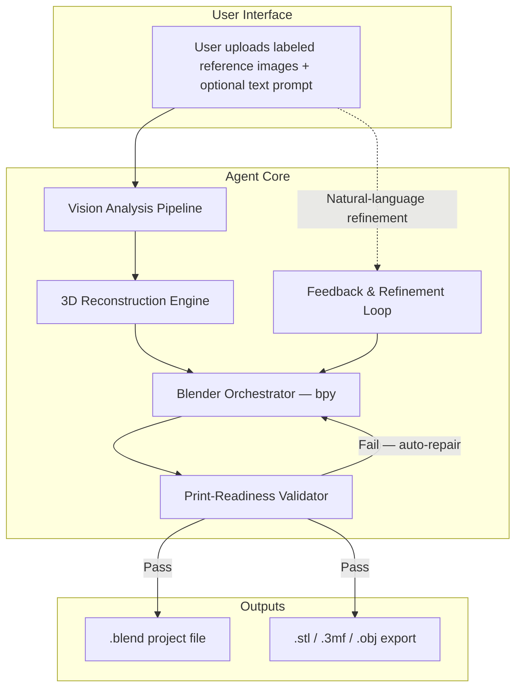
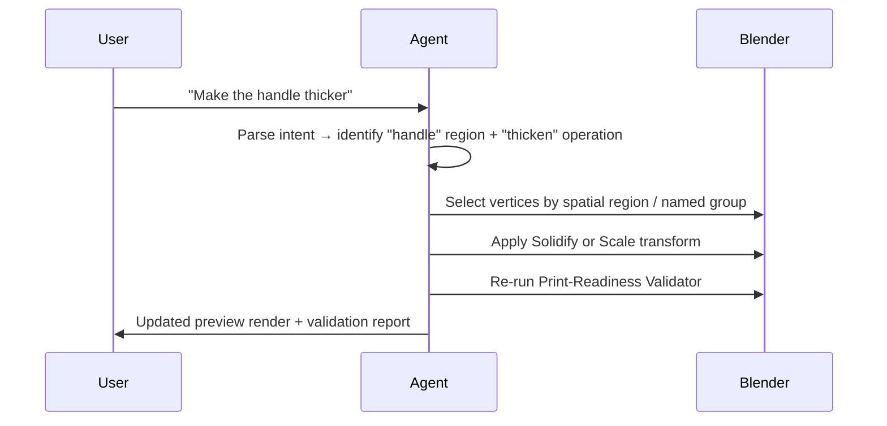

# PRD-001 · Tessera — AI Agent for Image-to-3D-Printable Object Generation

| Field | Value |
|---|---|
| **Version** | 0.6.0-DRAFT |
| **Status** | 🟡 Draft — Incorporating Stakeholder Feedback |
| **Author** | Derek (Owner) |
| **Created** | 2026-03-25 |
| **Last Updated** | 2026-09-22 |

---

## 1 · Executive Summary

**Tessera** is a **Blender add-on** powered by AI that accepts one or more reference renderings (photos, concept art, sketches) of a desired object and autonomously produces a 3D-printable model inside Blender. All inference runs **locally on the user's GPU** — no cloud dependencies. The agent bridges the gap between *"I have a picture of what I want"* and *"I have an STL on my print bed"* — no 3D-modeling expertise required.

### Core Value Proposition

> Give the agent a couple of images → receive a watertight, manifold `.stl` / `.3mf` file ready for slicing.

---

## 2 · Problem Statement

1. **Skill barrier** — Turning a mental image (or photo reference) into a printable 3D model requires proficiency in CAD/polygon modeling, UV mapping, and print-readiness validation.
2. **Time cost** — Even for experienced modelers, going from reference images to a clean, printable mesh is hours of manual work.
3. **Quality gap** — Existing image-to-3D services (Tripo, Meshy, etc.) produce meshes that are often non-manifold, have bad topology, or lack the geometric precision needed for FDM/SLA printing.

---

## 3 · Goals & Non-Goals

### Goals

| # | Goal |
|---|---|
| G1 | Accept ≥1 reference image and infer the 3D geometry of the depicted object |
| G2 | Produce geometry **inside Blender** so the user retains full editability |
| G3 | Guarantee the output mesh is **manifold, watertight, and 3D-print-ready** |
| G4 | Support common consumer printers (FDM & resin/SLA) with configurable print constraints |
| G5 | Provide an iterative feedback loop — user can request modifications in natural language |
| G6 | Export to `.stl`, `.3mf`, and `.obj` with correct unit scaling (mm) |
| G7 | Let users choose their own models — the curated list is a default, not a limit — without weakening the licence or integrity guarantees (added 2026-09-21) |

### Non-Goals (v1)

| # | Non-Goal | Rationale |
|---|---|---|
| NG1 | Full-color / multi-material texture mapping for print | Deferred — stakeholder decision (2026-03-26) |
| NG2 | Direct slicer integration (Cura, PrusaSlicer) | Out of scope for MVP |
| NG3 | Real-time collaborative editing | Not applicable to local add-on model |
| NG4 | Multi-part assemblies with mechanical joints | Deferred — stakeholder decision (2026-03-26) |
| NG5 | Cloud-hosted or CLI deployment | Add-on only — stakeholder decision (2026-03-26) |
| NG6 | CPU-only inference fallback | GPU required — stakeholder decision (2026-03-26) |
| NG7 | External commercial API calls (Tripo, Meshy, etc.) | Local/self-hosted only — stakeholder decision (2026-03-26) |
| NG8 | Non-CUDA inference backends — AMD (ROCm) and Apple Silicon (Metal) | **v1 is NVIDIA CUDA only** — stakeholder decision (2026-09-21). GPU *detection* still covers all three backends, but no inference adapter implements a non-CUDA device path, and the add-on says so before generation rather than failing at model load. Support is tracked by TASK-TS-0022 and is a prerequisite for the v1.0 marketplace listing. |

---

## 4 · User Stories

| ID | Persona | Story | Acceptance Criteria |
|---|---|---|---|
| US-01 | Hobbyist maker | *"I took two photos of a figurine I want to replicate. I upload them and get an STL I can print."* | Agent produces a watertight STL within 10 min; prints successfully on a stock Ender 3. |
| US-02 | Product designer | *"I have concept sketches from different angles. I need a Blender file I can refine before printing."* | Agent outputs a `.blend` file with clean quad-dominant topology and named object hierarchy. |
| US-03 | Hobbyist maker | *"The first result is close but the base is too thin. I tell the agent 'make the base 5 mm thicker' and it updates the model."* | Agent modifies geometry in-place; re-validates print-readiness. |
| US-04 | Educator / student | *"I draw a shape on paper, photograph it, and the agent turns it into a 3D object I can hold."* | Agent handles low-quality phone-camera input; gracefully degrades or requests a clearer image. |

---

## 5 · System Architecture

### 5.1 · Vision Analysis Pipeline

| Responsibility | Detail |
|---|---|
| **View-label ingestion** | Accept user-supplied view labels per image (see §6). When labels are provided, skip pose estimation and use canonical camera matrices for the labeled direction. When labels are absent, attempt auto-detection via a lightweight classifier (object silhouette + Up-vector heuristic) and confirm with the user if confidence is low. |
| **Multi-view alignment** | If multiple images are provided, estimate relative camera poses (structure-from-motion lite). User-supplied view labels act as **strong priors** that constrain the pose graph, dramatically improving reconstruction accuracy and speed. |
| **Depth estimation** | Run monocular depth prediction (e.g., Depth Anything V2, Marigold) to produce depth maps per image. |
| **Segmentation** | Isolate the target object from background using SAM 2 or equivalent. |
| **Feature extraction** | Extract shape priors, symmetry cues, and surface-normal hints to guide reconstruction. |

### 5.2 · 3D Reconstruction Engine

This is the core intelligence layer. It combines outputs from §5.1 to produce an initial 3D mesh.

| Strategy | When to use | Tech |
|---|---|---|
| **Multi-view reconstruction** | ≥3 images with different viewpoints | Classical MVS + neural refinement (e.g., NeuS2, Instant-NGP → mesh extraction) — runs locally on GPU |
| **Single/few-image generation** | 1–2 images | Image-conditioned 3D diffusion model — **TRELLIS (MIT) in v1**; all local inference, no external API calls. The adapter layer accepts alternatives, but any new weight must clear the licence gate (D8) before it ships |
| **Sketch-to-3D** | Hand-drawn input detected | Specialized sketch-conditioned model with symmetry priors — local inference |

> [!IMPORTANT]
> The reconstruction engine should be **model-agnostic** — designed as a pluggable adapter layer so new models can be swapped in as the field evolves rapidly. The adapter interface should normalize all outputs to a common mesh representation (vertices, faces, optional vertex colors).

> [!IMPORTANT]
> **Where inference runs.** PyTorch and TRELLIS's compiled CUDA extensions cannot ship inside a Blender add-on archive. The adapters therefore run in a **separately installed local engine process** with its own virtual environment, reached by the add-on over loopback HTTP; the add-on keeps the UI, weight management and the licence gate, and hands the engine absolute, already-verified weight paths. Inference remains entirely local — the engine makes no network call (D3). This is decision D10, taken in ADR-0001 and specified by SPEC-TS-0023.

### 5.3 · Blender Orchestrator (`bpy`)

All geometry manipulation happens inside Blender via its Python API. The orchestrator:

1. **Imports** the raw mesh from the reconstruction engine.
2. **Cleans topology** — removes doubles, recalculates normals, applies remesh if needed.
3. **Applies modifiers** — Subdivision Surface, Solidify (for thin-wall enforcement), Decimate (poly-count optimization for print).
4. **Scales to real-world units** — maps the mesh to mm using user-specified or inferred dimensions.
5. **Positions for print** — orients the object to minimize supports; flattens the bottom face.
6. **Executes refinement commands** — parses natural-language user feedback into `bpy.ops` calls (e.g., *"make it taller"* → scale Z, *"smooth the edges"* → bevel + subdivision).

### 5.4 · Print-Readiness Validator

Runs an automated validation pass before export. Leverages Blender's built-in **3D Print Toolbox** add-on + custom checks.

| Check | Method | Auto-Repair |
|---|---|---|
| Non-manifold edges | `bpy.ops.mesh.select_non_manifold()` | Fill holes, merge by distance |
| Self-intersections | BVH tree overlap test (`mathutils.bvhtree`) | Boolean union to self |
| Zero-area faces | Face area < ε | Dissolve degenerate faces |
| Minimum wall thickness | Ray-cast inward from every face; flag if < user threshold (default 1.2 mm FDM / 0.5 mm SLA) | Solidify modifier |
| Overhang angle | Face normal vs. build-plate normal > 45° | Flag for user; optionally auto-orient |
| Mesh volume | Must be > 0 (closed surface) | Watertight repair via voxel remesh fallback |
| Scale sanity | Bounding box within user-specified max print volume | Warn or auto-scale |

### 5.5 · Feedback & Refinement Loop

Key capabilities:
- **Semantic part identification** — The agent must map natural-language part names ("handle", "base", "lid") to mesh regions via segmentation or named vertex groups set during initial reconstruction.
- **Undo stack** — Every operation is recorded; user can say *"undo that"* or *"go back to version 2"*.
- **Preview rendering** — After each edit, the agent renders a quick preview (Eevee or Workbench) and returns it to the user.

---

## 6 · Input Specification

| Input | Required | Format | Notes |
|---|---|---|---|
| Reference images | ✅ (≥1) | `.jpg`, `.png`, `.webp`, `.heic` | Ideally 2–6 images from different angles |
| **View labels** | **Recommended** | One label per image (see table below) | Tells the agent which direction each image depicts. Dramatically improves reconstruction accuracy. If omitted, the agent will attempt auto-detection and may prompt for confirmation. |
| Text prompt | Optional | Free-form string | Describe the object, desired size, material intent |
| Target dimensions | Optional | `{"width_mm": 80, "height_mm": 120}` | If omitted, agent infers from object type or asks |
| Printer profile | Optional | `FDM` or `SLA` + build volume | Defaults to generic FDM 220×220×250 mm |
| Style hints | Optional | `"organic"`, `"hard-surface"`, `"low-poly"` | Influences topology strategy |

#### View Label Vocabulary

| Label | Camera Direction | Canonical Azimuth / Elevation |
|---|---|---|
| `front` | Looking at the front face | 0° / 0° |
| `back` | Looking at the rear face | 180° / 0° |
| `left` | Looking at the left side | 270° / 0° |
| `right` | Looking at the right side | 90° / 0° |
| `top` | Looking straight down | — / 90° |
| `bottom` | Looking straight up | — / −90° |
| `front-left` | 45° between front and left | 315° / 0° |
| `front-right` | 45° between front and right | 45° / 0° |
| `isometric` | Standard isometric view | 45° / 35° |
| `custom:<az>,<el>` | User-specified angles in degrees | User-defined |

> [!TIP]
> Users don't need to label every image. Even a single labeled image (e.g., `front`) anchors the coordinate system and lets the agent infer poses for the remaining unlabeled images more reliably.

#### Auto-Detection Fallback

When view labels are omitted, the agent runs a lightweight view-direction classifier:
1. Object silhouette analysis + up-vector heuristic
2. If confidence ≥ 80%, the detected label is used with a note to the user
3. If confidence < 80%, the agent asks the user to confirm or provide labels before proceeding

---

## 7 · Output Specification

| Output | Format | Guarantee |
|---|---|---|
| Blender project | `.blend` | Contains named objects, modifiers preserved, scene hierarchy |
| Print-ready mesh | `.stl` (binary), `.3mf`, `.obj` | Manifold, watertight, correct normals, mm scale |
| Validation report | JSON + human-readable summary | All checks from §5.4 with pass/warn/fail |
| Preview renders | `.png` (4 views: front, side, top, perspective) | Generated via Eevee for speed |

---

## 8 · Technology Stack

| Layer | Technology | Rationale |
|---|---|---|
| Deployment | **Blender add-on** (GPL-2.0-or-later) **plus a separately installed local inference engine** | The add-on gives native UI integration and stays small enough for the Extensions Platform; the engine carries PyTorch, the CUDA runtime and TRELLIS's compiled extensions, which cannot ship in an add-on archive. Both halves are GPL-2.0-or-later. See D10, ADR-0001, SPEC-TS-0023 |
| Agent framework | LangGraph / custom agent loop | Tool-use orchestration with state management |
| LLM backbone | Local LLM (e.g., Llama 3, Qwen 2.5) or local API to Claude / Gemini | Code generation + vision understanding; must run locally or via user's own API key |
| Compute backend | **NVIDIA CUDA only (v1)** | Every inference adapter targets CUDA. AMD (ROCm) and Apple Silicon (Metal) GPUs are detected and displayed but cannot run inference — see NG8 and TASK-TS-0022. The engine installer ships for Linux x64 in v1; Windows follows a code-signing identity, macOS follows non-CUDA support |
| Inference runtime | **Local engine process**, own pinned CPython and virtual environment, loopback HTTP, request-authenticated | Keeps a multi-gigabyte CUDA stack out of the add-on archive, contains inference crashes and OOM outside Blender, makes adapters testable in CI without Blender, and turns non-CUDA support into an engine build rather than an add-on redesign (D10) |
| Vision models | Depth Anything V2 (Small, Apache-2.0), SAM 2, DINOv2 | Depth, segmentation, feature extraction — **local GPU inference only**. Weight licences are recorded in `MODEL-LICENSES.md`; non-commercial weights are gated |
| Model distribution | **No weights bundled.** A small curated set downloads on first use; the list is **user-extensible** from Hugging Face | Keeps the add-on small and the licence surface narrow, and lets users trade VRAM for accuracy or follow the field without waiting for a release. Added models are licence-classified, commit-pinned and checksum-verified before download (SPEC-TS-0002 FR-026 – FR-033) |
| 3D reconstruction | **TRELLIS (MIT)** in v1; adapter layer is model-agnostic | Pluggable; best-of-breed per input type — **all self-hosted, no external APIs**. Zero-1-to-3++ and InstantMesh were evaluated and removed from the shipped manifest on 2026-09-21 — no adapter used them, and their terms are unresolved (see `MODEL-LICENSES.md`) |
| 3D engine | Blender 4.x+ (`bpy` Python API) | Industry-standard, scriptable, free |
| Mesh processing | `trimesh`, `PyMeshLab`, Blender modifiers | Repair, remesh, boolean operations |
| Export | Blender built-in exporters | STL, 3MF, OBJ |
| Print validation | Blender 3D Print Toolbox + custom scripts | Manifold / watertight / thickness checks |
| License | GPL v2+ | Required for Blender add-on distribution — accepted by stakeholder |

---

## 9 · Phased Roadmap

### Phase 1 — Foundation (Weeks 1–4)

| Milestone | Deliverable |
|---|---|
| M1.1 | Blender add-on scaffold — registration, UI panel, preferences for GPU config |
| M1.2 | Local model weight management (download, cache, version) |
| M1.3 | Image ingestion pipeline — segmentation + depth estimation (local GPU) |
| M1.4 | Single-image-to-mesh via self-hosted model (e.g., Trellis / InstantMesh) |
| M1.5 | Basic mesh import into Blender + auto-repair to manifold |
| M1.6 | STL export with print-readiness validation (pass/fail) |

**Exit criteria:** Given 1 image of a simple object (mug, vase), produce a printable STL.

---

### Phase 2 — Multi-View & Quality (Weeks 5–8)

| Milestone | Deliverable |
|---|---|
| M2.1 | Multi-image alignment + improved reconstruction |
| M2.2 | Topology optimization — quad remesh, poly-count control |
| M2.3 | Real-world scaling (user-specified or inferred dimensions) |
| M2.4 | Print orientation optimizer (minimize supports) |
| M2.5 | 4-view preview render pipeline |

**Exit criteria:** Given 3+ images of a moderately complex object, produce a clean mesh with <5% non-quad faces and correct mm dimensions.

---

### Phase 3 — Intelligence & Refinement (Weeks 9–12)

| Milestone | Deliverable |
|---|---|
| M3.1 | Natural-language refinement loop (e.g., *"make it wider"*) |
| M3.2 | Semantic part identification + named vertex groups |
| M3.3 | Undo / version history |
| M3.4 | Sketch-to-3D pathway |
| M3.5 | Printer profile presets (Ender 3, Prusa MK4, Elegoo Mars, etc.) |

**Exit criteria:** User can iteratively refine a model through 5+ rounds of feedback; all outputs remain print-valid.

---

### Phase 4 — Production Hardening (Weeks 13–16)

| Milestone | Deliverable |
|---|---|
| M4.1 | Robust error handling + graceful degradation on bad input |
| M4.2 | Performance optimization (target: <5 min end-to-end for simple objects) |
| M4.3 | `.3mf` export with metadata (print settings, infill suggestions) |
| M4.4 | Automated regression test suite (golden-mesh comparison) |
| M4.5 | Documentation, tutorials, example gallery |

**Exit criteria:** 90% of test-suite objects produce print-successful STLs on first attempt.

---

## 10 · Success Metrics

| Metric | Target | How Measured |
|---|---|---|
| **Print success rate** | ≥85% first-attempt print success | Test prints on FDM + SLA printers across object categories |
| **Manifold pass rate** | 100% of exported meshes | Automated validation in CI |
| **End-to-end latency** | <5 min (simple), <15 min (complex) | Wall-clock time from image upload to STL export |
| **Refinement accuracy** | ≥80% of natural-language edits correctly applied | Human evaluation on test set of 50 edit commands |
| **User satisfaction** | ≥4.2 / 5.0 | Post-task survey |

---

## 11 · Risks & Mitigations

| Risk | Impact | Likelihood | Mitigation |
|---|---|---|---|
| AI reconstruction produces non-printable geometry | High | Medium | Multi-stage validation + voxel-remesh fallback; never export without passing all checks |
| Single-image depth ambiguity leads to wrong proportions | Medium | High | Prompt user for dimensions or additional views; use object-class priors |
| Blender API breaking changes across versions | Medium | Low | Pin minimum Blender version; abstract `bpy` calls behind versioned adapter |
| Local GPU VRAM insufficient for large models | Medium | Medium | Tiered model selection based on detected VRAM; graceful error with minimum-spec guidance |
| **Mac and AMD buyers cannot run v1** — Blender's user base is Mac-heavy | High | High | NVIDIA-only stated in every listing, the README, the docs site and a runtime banner; MPS support raised as TASK-TS-0022 before the v1.0 listing |
| Third-party model weights carry non-commercial or undeclared licences | High | Medium | Licence metadata per model in the manifest, fail-closed download gate, `MODEL-LICENSES.md` (SPEC-TS-0002 v1.2) |
| A user adds a model whose licence forbids their use of it | Medium | Medium | Declared licence classified and shown before download; non-commercial, restricted and undeclared terms refused unless the user opts in; responsibility stated in the add dialog and the Custom Models documentation. Tessera never hosts or redistributes weights (SPEC-TS-0002 v1.3) |
| Model weight download size / disk usage | Low | High | Lazy download on first use; clear cache management in add-on preferences |
| Reconstruction model quality degrades on unusual objects | High | Medium | Model-agnostic adapter allows hot-swap; ensemble multiple models and pick best |
| Natural-language edit misinterpretation | Medium | Medium | Confirm ambiguous edits with user before applying; show diff preview |
| Large meshes exceed print-bed volume | Low | Low | Scale-check gate in validator; warn user with suggested scale factor |

---

## 12 · Resolved Decisions

> [!NOTE]
> All original open questions have been resolved (2026-03-26).

| # | Question | Decision | Impact |
|---|---|---|---|
| D1 | Deployment model | **Blender add-on** | Architecture is add-on-first; UI lives in Blender's sidebar panel. No web UI or CLI needed. |
| D2 | GPU requirements | **GPU required — no CPU fallback** | Simplifies inference stack; add-on checks for a usable GPU on install and reports minimum VRAM. |
| D3 | Commercial API fallback | **Local / self-hosted only** | All models run on user's hardware. No network calls for inference. User data never leaves their machine. |
| D4 | Multi-part objects | **Deferred to v2+** | v1 treats all input as a single solid object. Multi-part support is a future milestone. |
| D5 | Texture / color | **Deferred to v2+** | v1 exports geometry only (no vertex colors or textures). Color support is a future milestone. |
| D6 | Licensing | **GPL accepted** | Add-on code will be GPL v2+, consistent with Blender's license. |
| D7 | Non-CUDA GPUs | **NVIDIA CUDA only in v1** (2026-09-21) | Detection covers CUDA/ROCm/Metal, but no adapter implements a non-CUDA device path. Shipping the claim without the implementation was the single largest refund risk in the GTM analysis. MPS support is TASK-TS-0022; the thin-add-on / local-engine ADR would unlock ROCm and Metal together with the free Extensions Platform channel. |
| D8 | Third-party weight licences | **Fail closed — refuse by default** (2026-09-21) | Model weights are not covered by Tessera's GPL-2.0-or-later licence. Every manifest entry declares `license`, `license_url` and `commercial_use`; anything not unambiguously `allowed` — including undeclared terms — is refused unless the user opts in via **Allow Restricted-Licence Models**. Implemented in SPEC-TS-0002 v1.2; terms recorded in `MODEL-LICENSES.md` and re-verified before any commercial release. |
| D10 | Inference runtime delivery | **Thin add-on plus a separately installed local engine process** (2026-09-22) | PyTorch with CUDA is measured in gigabytes and TRELLIS's compiled extensions often have no prebuilt wheel, so neither can ship in an add-on archive; bundling them was rejected on size, distribution surface and installability. The add-on keeps UI, weight management and the licence gate and hands the engine verified absolute paths; the engine runs the adapters and reaches nothing but its own loopback port. Decided in ADR-0001, specified by SPEC-TS-0023. Consequences: a second installable artifact with its own platform matrix (Linux x64 in v1), a negotiated protocol version between the two halves, and SPEC-TS-0003, 0004, 0007, 0010, 0011 and 0015 amended to match. |
| D9 | Model selection | **Curated default set, user-extensible list** (2026-09-21) | Tessera ships no weights. The bundled manifest is the recommended set; users may add any compatible Hugging Face model, which Tessera licence-classifies, commit-pins and checksum-verifies before download. Adapters can only load architectures they implement, so additions are constrained to known families. |

---

## 13 · Glossary

| Term | Definition |
|---|---|
| **Manifold** | A mesh where every edge is shared by exactly two faces — no holes, no dangling geometry |
| **Watertight** | A manifold mesh that forms a completely closed volume — required for slicers to compute infill |
| **FDM** | Fused Deposition Modeling — standard filament-based 3D printing |
| **SLA** | Stereolithography — resin-based 3D printing with higher detail |
| **bpy** | Blender's Python API module for scripting and automation |
| **STL** | Standard Tessellation Language — the most common 3D print file format |
| **3MF** | 3D Manufacturing Format — modern replacement for STL with metadata support |
| **Slicer** | Software that converts a 3D mesh into G-code instructions for a printer |

---

## Appendix A · Competitive Landscape

| Tool | Strengths | Gaps (that Tessera fills) |
|---|---|---|
| **Tripo AI** | Fast image-to-3D; decent texture | Output rarely manifold; no print validation; no Blender integration |
| **Meshy AI** | Good PBR textures; game-ready output | Focused on game assets, not print; topology not optimized for printing |
| **Neural4D** | Clean quad topology | Proprietary; no iterative refinement; no print-specific checks |
| **OpenSCAD** | Parametric, always manifold | Requires programming; no image input; hard-surface only |
| **Blender (manual)** | Full creative control | Requires expert skill; no AI assistance |

Tessera combines AI reconstruction with Blender's full editing power and print-specific validation — a combination no existing tool provides end-to-end.

---

## Appendix B · Revision History

| Version | Date | Author | Summary of Changes |
|---|---|---|---|
| 0.1.0-DRAFT | 2026-03-25 | Derek | Initial PRD. |
| 0.2.0-DRAFT | 2026-03-26 | Derek | Incorporated stakeholder feedback; recorded decisions D1–D6 and non-goals NG1–NG7. |
| 0.3.0-DRAFT | 2026-03-26 | Derek | Phased roadmap, success metrics and risk register finalised for Phase 1 kickoff. |
| 0.4.0-DRAFT | 2026-09-21 | Derek | Added NG8 and D7 — v1 is NVIDIA CUDA only; GPU detection still covers ROCm and Metal but no adapter implements a non-CUDA device path (TASK-TS-0022 gates the v1.0 listing). Added the Mac/AMD addressable-market risk to §11. Added D8 — third-party model weights fail closed on licence, implemented by SPEC-TS-0002 v1.2, with a matching §11 risk row and a licence note on the §8 vision-model row. Narrowed the §5.2 and §8 reconstruction entries to TRELLIS, the only reconstruction weight in the shipped manifest. |
| 0.6.0-DRAFT | 2026-09-22 | Derek | Added D10 — the inference runtime is delivered as a thin add-on plus a separately installed local engine process, decided in ADR-0001 and specified by SPEC-TS-0023. Updated §5.2 to say where inference runs, and §8 to describe both deployment artifacts, the engine's own runtime row, and the Windows x64 / Linux x64 installer matrix that follows from v1 being CUDA-only. |
| 0.5.0-DRAFT | 2026-09-21 | Derek | Added goal G7 and decision D9 — the curated model list is a default, not a limit: users may add any compatible Hugging Face model, licence-classified, commit-pinned and checksum-verified before download (SPEC-TS-0002 FR-026 – FR-033). Added the matching §11 risk for a user adding a model whose licence forbids their use of it, and a Model distribution row to §8. Renumbered the user-extensible-models decision from D8 to D9 — 0.4.0 had already assigned D8 to the fail-closed weight-licence decision, and two rows briefly shared the identifier. |
