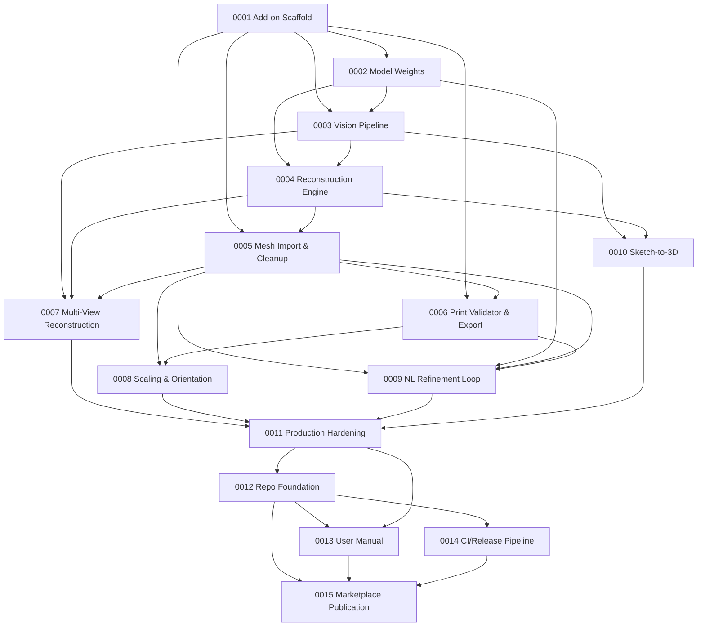

# Tessera — Task Index

> All tasks derived from [PRD-001_Tessera.md](PRD-001_Tessera.md).  
> Each task follows the template at `.agent/templates/task-template.md` and will be expanded into a full Spec.

---

## Dependency Graph

---

## Phase 1 — Foundation (Weeks 1–4)

| Task ID | Title | Size | Risk | Status |
|---------|-------|------|------|--------|
| [TASK-TS-0001](tasks/TASK-TS-0001-addon-scaffold.md) | Blender Add-on Scaffold & GPU Config | L | Low | ☐ Not Started |
| [TASK-TS-0002](tasks/TASK-TS-0002-model-weight-management.md) | Local Model Weight Management | M | Med | ☐ Not Started |
| [TASK-TS-0003](tasks/TASK-TS-0003-vision-pipeline.md) | Vision Pipeline — Segmentation, Depth & View Labels | L | Med | ☐ Not Started |
| [TASK-TS-0004](tasks/TASK-TS-0004-reconstruction-engine.md) | Single-Image 3D Reconstruction Engine | XL | High | ☐ Not Started |
| [TASK-TS-0005](tasks/TASK-TS-0005-mesh-import-cleanup.md) | Mesh Import, Cleanup & Topology Optimization | L | Low | ☐ Not Started |
| [TASK-TS-0006](tasks/TASK-TS-0006-print-validator-export.md) | Print-Readiness Validator & Export Pipeline | L | Low | ☐ Not Started |

**Phase 1 Exit Criteria:** Given 1 image of a simple object (mug, vase), produce a printable STL.

---

## Phase 2 — Multi-View & Quality (Weeks 5–8)

| Task ID | Title | Size | Risk | Status |
|---------|-------|------|------|--------|
| [TASK-TS-0007](tasks/TASK-TS-0007-multi-view-reconstruction.md) | Multi-View Alignment & Enhanced Reconstruction | XL | High | ☐ Not Started |
| [TASK-TS-0008](tasks/TASK-TS-0008-scaling-orientation.md) | Real-World Scaling & Print Orientation | M | Med | ☐ Not Started |

**Phase 2 Exit Criteria:** Given 3+ images, produce a clean mesh with correct mm dimensions.

---

## Phase 3 — Intelligence & Refinement (Weeks 9–12)

| Task ID | Title | Size | Risk | Status |
|---------|-------|------|------|--------|
| [TASK-TS-0009](tasks/TASK-TS-0009-nl-refinement-loop.md) | Natural-Language Refinement Loop | XL | High | ☐ Not Started |
| [TASK-TS-0010](tasks/TASK-TS-0010-sketch-to-3d.md) | Sketch-to-3D Pathway | L | High | ☐ Not Started |

**Phase 3 Exit Criteria:** User can iteratively refine through 5+ rounds of feedback; all outputs remain print-valid.

---

## Phase 4 — Production Hardening (Weeks 13–16)

| Task ID | Title | Size | Risk | Status |
|---------|-------|------|------|--------|
| [TASK-TS-0011](tasks/TASK-TS-0011-production-hardening.md) | Production Hardening, Testing & Documentation | XL | Low | ☐ Not Started |

**Phase 4 Exit Criteria:** 90% of test-suite objects produce print-successful STLs on first attempt.

---

## Phase 5 — Open Source & Publication (Weeks 17–20)

| Task ID | Title | Size | Risk | Status |
|---------|-------|------|------|--------|
| [TASK-TS-0012](tasks/TASK-TS-0012-repo-foundation.md) | Repository Foundation & Open-Source Readiness | M | Low | ☐ Not Started |
| [TASK-TS-0013](tasks/TASK-TS-0013-user-manual.md) | Comprehensive User Manual & Documentation Site | XL | Med | ☐ Not Started |
| [TASK-TS-0014](tasks/TASK-TS-0014-ci-release-pipeline.md) | CI Pipeline, Semantic Release & Add-on Packaging | L | Med | ☐ Not Started |
| [TASK-TS-0015](tasks/TASK-TS-0015-marketplace-publication.md) | Marketplace Strategy & Publication | L | Med | ☐ Not Started |

**Phase 5 Exit Criteria:** Tessera is publicly available on GitHub with automated CI/CD, listed on at least 2 marketplaces, and has comprehensive user documentation.
