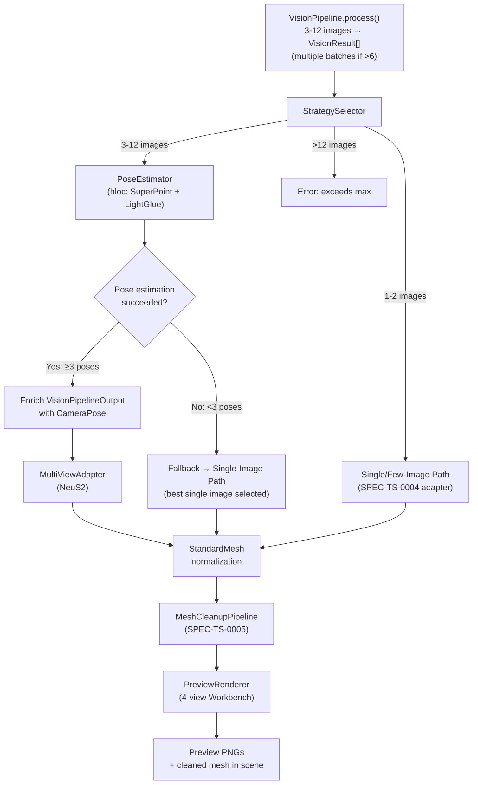
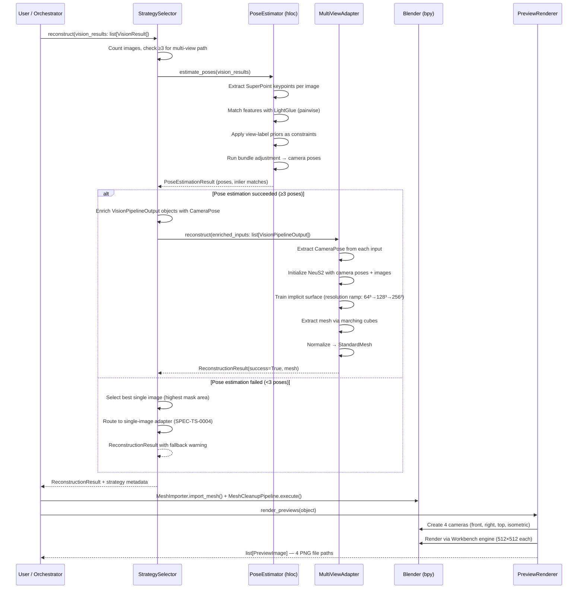

# Feature Specification: Multi-View Alignment & Enhanced Reconstruction

> **Quick Start:** Fill sections in order. Use the AI-Readiness Self-Score at the end to verify ≥80 before submitting for CSO approval. Sections marked [CONDITIONAL] can be skipped if not applicable.

---

## Metadata

| Field | Value |
|-------|-------|
| **Spec ID** | SPEC-TS-0007 |
| **Task ID** | TASK-TS-0007 |
| **Status** | Submitted |
| **Version** | 1.2 |
| **Created** | 2026-04-10 |
| **Last Updated** | 2026-09-22 |
| **Author** | Orchestrator (AI) |
| **Pod** | Tessera |
| **CSO Approver** | Derek |
| **Spec Type** | Feature |

### Status Transitions
| From | To | Trigger |
|------|----|---------|
| Draft | In Review | Author submits, AI-Readiness ≥80 |
| In Review | Approved | CSO approves |
| In Review | Draft | CSO requests changes |
| Approved | In Progress | Orchestrator begins implementation |
| In Progress | Complete | PR merged |

---

## 1. PROBLEM STATEMENT

### 1.1 Business Context
Single-image 3D reconstruction (SPEC-TS-0004) is inherently ambiguous — the back, top, and occluded surfaces of an object are always "guessed" by the model. This produces meshes with correct front geometry but inaccurate proportions on unseen sides. Multi-view reconstruction using 3 or more reference images from different angles dramatically reduces this ambiguity by providing real observations of multiple surfaces.

This task is the primary quality upgrade from Phase 1's "cool demo" to Phase 2's "actually printable replica." It implements PRD milestone M2.1 (multi-image alignment + improved reconstruction) and M2.5 (4-view preview render pipeline). Building on the existing adapter pattern from SPEC-TS-0004, this feature adds a new multi-view reconstruction adapter to the `AdapterRegistry` and introduces a camera pose estimation stage that transforms the vision pipeline's per-image outputs into a spatially coherent multi-view dataset.

### 1.2 User Story
**As a** user who took photos of an object from multiple angles,  
**I want** the agent to combine all my photos into a more accurate 3D model,  
**So that** the printed result closely matches the real object from every angle.

### 1.3 Proposed Approach
Build three components:

1. **Pose estimation module** — A lightweight Structure-from-Motion (SfM) pipeline using hloc (hierarchical localization) with SuperPoint feature detection + LightGlue matching. User-supplied view labels from the vision pipeline (SPEC-TS-0003) act as strong priors constraining the pose graph. The output is a set of camera intrinsics and extrinsics for each image.

2. **Multi-view reconstruction adapter** — A new `ReconstructionAdapter` implementation (SPEC-TS-0004 interface) that accepts ≥3 images with estimated camera poses (passed via enriched `VisionPipelineOutput` objects) and runs NeuS2 neural surface reconstruction with marching cubes mesh extraction. The adapter produces a `StandardMesh` via the existing normalization pipeline.

3. **Strategy selector** — Automatic routing logic: 1–2 images → SPEC-TS-0004's single/few-image path; 3–12 images → multi-view path. Falls back to the single-image path when SfM fails (e.g., textureless or reflective objects). Rejects >12 images with an error.

4. **Preview render pipeline** — After reconstruction, renders 4 preview images (front, right, top, isometric) via Blender's Workbench engine for quick visual validation before the user commits to cleanup and export.

### 1.4 Success Metrics [OPTIONAL]

| Metric | Current | Target | How Measured |
|--------|---------|--------|--------------|
| Multi-view reconstruction quality improvement | N/A (single-image only) | ≥ 30% reduction in Chamfer distance vs. single-image path on 10-object test set with 4 views each | PyMeshLab Chamfer distance against ground-truth scans |
| Pose estimation success rate | N/A | ≥ 85% on textured objects with ≥3 images at ≥45° angular separation | Binary pass/fail: pose graph produces ≥3 camera poses |
| Multi-view pipeline latency | N/A | < 5 minutes end-to-end for 3–6 images | Wall-clock time from `reconstruct()` call to `StandardMesh` return |
| Preview render latency | N/A | < 10 seconds for 4 views | Wall-clock time for all 4 Workbench renders |

---

## 2. TECHNICAL CONTEXT

> ⚠️ **AI needs this context BEFORE generating code.** Provide patterns and references here.

### 2.1 Related Code Patterns
| File/Module | Purpose | Use As Reference For |
|-------------|---------|----------------------|
| `tessera/reconstruction/adapter.py` | `ReconstructionAdapter` ABC + `VisionPipelineOutput` (SPEC-TS-0004) | Implementing the multi-view adapter using the same interface |
| `tessera/reconstruction/registry.py` | `AdapterRegistry` — discovers and selects adapters (SPEC-TS-0004) | Registering the multi-view adapter with higher priority for ≥3 inputs |
| `tessera/reconstruction/mesh_output.py` | `StandardMesh` + `ReconstructionResult` dataclasses (SPEC-TS-0004) | Output format for the multi-view adapter |
| `tessera/reconstruction/engine.py` | `ReconstructionEngine` — orchestrates adapter selection (SPEC-TS-0004) | Extending strategy selection with image-count routing |
| `tessera/vision/types.py` | `VisionResult` dataclass (SPEC-TS-0003) | Input format — segmentation masks, depth maps, view labels, DINOv2 features |
| `tessera/gpu_detection.py` | GPU info API (SPEC-TS-0001) | Querying available VRAM before loading SfM + reconstruction models |
| [hloc](https://github.com/cvg/Hierarchical-Localization) | Hierarchical Localization — SfM with SuperPoint + LightGlue | Pose estimation pipeline |
| [NeuS2](https://github.com/19reborn/NeuS2) | Multi-view neural surface reconstruction | Primary multi-view reconstruction backend |
| [Instant-NGP](https://github.com/NVlabs/instant-ngp) | Fast NeRF training + marching cubes | Alternative multi-view reconstruction backend |

### 2.2 Tech Stack & Standards
- **Language:** Python 3.11+ (Blender's bundled Python)
- **Framework:** Blender 4.2+ LTS Python API (`bpy`) + PyTorch (for model inference)
- **SfM:** hloc (SuperPoint + LightGlue) — GPU-accelerated
- **Reconstruction:** NeuS2 or Instant-NGP with marching cubes extraction
- **Mesh Processing:** `trimesh` for intermediate mesh handling, `numpy` for vertex/face arrays
- **Rendering:** Blender Workbench engine for preview renders
- **Validation:** Runtime assertions + type checking via `dataclasses` / `typing`
- **Testing:** `pytest` run via `blender --background --python` for headless testing
- **License:** GPL v2+

### 2.3 Architecture Notes

> **Batch ceiling interaction with SPEC-TS-0003:** The vision pipeline (SPEC-TS-0003) has `MAX_BATCH_SIZE = 6`. When a user provides 7–12 images, the orchestrator is responsible for splitting them into multiple vision pipeline batches (e.g., 2 × 6-image batches) and concatenating the resulting `VisionResult` lists before passing them to `StrategySelector`. The multi-view system receives the aggregated `list[VisionResult]` and does not interact with the vision pipeline directly.

```
tessera/
├── multiview/
│   ├── __init__.py
│   ├── strategy.py              # StrategySelector — routes 1-2 vs. 3-12 images
│   ├── pose_estimation/
│   │   ├── __init__.py
│   │   ├── base.py              # PoseEstimator ABC
│   │   ├── types.py             # CameraPose, PoseEstimationResult, PoseGraph
│   │   ├── hloc_estimator.py    # hloc-based SfM implementation
│   │   └── label_prior.py       # Converts view labels → initial camera pose priors
│   ├── reconstruction/
│   │   ├── __init__.py
│   │   ├── multiview_adapter.py # MultiViewAdapter — ReconstructionAdapter impl
│   │   └── neus2_backend.py     # NeuS2 inference wrapper
│   └── preview/
│       ├── __init__.py
│       ├── renderer.py          # PreviewRenderer — 4-view Workbench renders
│       └── camera_setup.py      # Canonical camera placement for preview views
```

**Data flow (multi-view path):**



**Sequence flow — multi-view reconstruction:**



---

## 3. FUNCTIONAL REQUIREMENTS

> ⚠️ **Use precise language:** SHALL (required), SHALL NOT (prohibited), SHOULD (recommended), SHOULD NOT (discouraged), MAY (optional). The keyword IS the priority.

### 3.1 Strategy Selection

| ID | Requirement |
|----|-------------|
| FR-001 | The system SHALL implement a `StrategySelector` class with constructor `StrategySelector(cache_dir: str)` where `cache_dir` is the model weight directory from add-on preferences (SPEC-TS-0001). The class SHALL accept a `list[VisionResult]` via its `reconstruct()` method and route reconstruction to one of two paths: **single/few-image** (1–2 images, delegated to the existing SPEC-TS-0004 adapter) or **multi-view** (3–12 images, using the new multi-view adapter). |
| FR-002 | The system SHALL select the multi-view path when the input contains ≥ 3 `VisionResult` objects with confirmed view labels (i.e., `label_needs_confirmation == False`). |
| FR-003 | The system SHALL fall back to the single/few-image path when the input contains ≥ 3 images but fewer than 3 have confirmed view labels, logging a warning: `"Only {n} of {total} images have confirmed view labels. Falling back to single-image reconstruction. Confirm or supply view labels for ≥3 images to enable multi-view mode."` |
| FR-004 | The system SHALL record the selected strategy in `ReconstructionResult.mesh.metadata["strategy"]` as one of: `"single_image"`, `"few_image"`, `"multi_view"`, or `"multi_view_fallback"`. This field is stored in `StandardMesh.metadata` (SPEC-TS-0004 §3.3) alongside existing keys (`model_name`, `inference_time_s`, `confidence`). |

### 3.2 Pose Estimation

| ID | Requirement |
|----|-------------|
| FR-005 | The system SHALL define an abstract base class `PoseEstimator` with the method `estimate_poses(vision_results: list[VisionResult]) → PoseEstimationResult`. |
| FR-006 | The system SHALL implement a concrete `HlocPoseEstimator` that uses SuperPoint for keypoint detection and LightGlue for feature matching. |
| FR-007 | The pose estimator SHALL extract SuperPoint keypoints and descriptors from each segmented image (mask applied — background zeroed out) at a maximum resolution of 1024×1024 pixels. |
| FR-008 | The pose estimator SHALL perform pairwise feature matching between all image pairs using LightGlue, producing a set of 2D–2D correspondences per pair. |
| FR-009 | The pose estimator SHALL use user-supplied view labels (from `VisionResult.view_label` where `label_source == "user"`) as **strong priors** to initialize camera extrinsics before bundle adjustment. View labels SHALL be converted to canonical camera poses using the azimuth/elevation mapping from PRD §6. |
| FR-010 | The pose estimator SHALL use auto-detected view labels (where `label_source == "auto"` and `label_confidence ≥ 0.80`) as **soft priors** with a weight proportional to the confidence score during bundle adjustment. |
| FR-011 | The pose estimator SHALL run a sparse bundle adjustment to refine camera intrinsics (focal length, principal point) and extrinsics (rotation, translation) using matched feature correspondences and view-label priors. |
| FR-012 | The system SHALL define a `CameraPose` dataclass containing: `rotation` (3×3 float64 ndarray — rotation matrix, world-to-camera), `translation` (3-element float64 ndarray — camera position in world coordinates), `focal_length` (float — pixels), `principal_point` (tuple[float, float] — pixels), `image_size` (tuple[int, int] — width, height), and `confidence` (float — pose estimation confidence, 0.0–1.0). |
| FR-013 | The system SHALL define a `PoseEstimationResult` dataclass containing: `poses` (list[CameraPose | None] — one per input image, `None` for images whose pose could not be estimated), `num_registered` (int — number of images with successfully estimated poses), `inlier_ratio` (float — ratio of inlier matches to total matches), `success` (bool — True if `num_registered ≥ 3`), and `error_message` (str — empty on success). |
| FR-014 | When pose estimation registers fewer than 3 cameras, the system SHALL set `PoseEstimationResult.success = False` with `error_message = "Pose estimation registered only {n} of {total} cameras. Insufficient overlap or texture for multi-view reconstruction. Falling back to single-image path."` |
| FR-015 | The pose estimator SHALL process all images sequentially on the GPU, loading and unloading the SuperPoint model and LightGlue model independently to avoid VRAM exhaustion. |

### 3.3 Multi-View Reconstruction Adapter

| ID | Requirement |
|----|-------------|
| FR-016 | The system SHALL implement a `MultiViewAdapter` class extending `ReconstructionAdapter` (SPEC-TS-0004) with a `reconstruct(inputs: list[VisionPipelineOutput]) → ReconstructionResult` method that conforms to the SPEC-TS-0004 ABC signature. Camera poses SHALL be passed by enriching each `VisionPipelineOutput` with an optional `camera_pose: CameraPose | None` field before invoking the adapter. The adapter SHALL extract poses from the enriched inputs internally. This approach preserves the existing `ReconstructionAdapter` interface without modification (CON-006). |
| FR-017 | The `MultiViewAdapter` SHALL declare `AdapterCapabilities` with: `model_name = "neus2-v1.0"`, `min_images = 3`, `max_images = 12`, `requires_depth = True`, `requires_mask = True`, `min_vram_gb = 8.0`, and `output_types = ["mesh"]`. |
| FR-018 | The adapter SHALL initialize the NeuS2 neural reconstruction model with the estimated camera poses (extracted from enriched inputs), masked images (background zeroed), and depth maps as supervision signals. Instant-NGP is documented as a future alternative backend and is excluded from this version. |
| FR-019 | The adapter SHALL train the implicit surface representation iteratively using a resolution ramp (64³ → 128³ → target resolution) for progressive refinement, running for a maximum of 20,000 optimization steps or until a convergence criterion is met (mean absolute loss change < 1e-5 computed over 500 consecutive steps), whichever comes first. |
| FR-020 | The adapter SHALL extract the final mesh via marching cubes at a configurable grid resolution (default: 256³, range: 128³ to 512³), producing a triangle mesh. |
| FR-021 | The adapter SHALL normalize the extracted mesh to a `StandardMesh` dataclass (SPEC-TS-0004) with vertices centered at the origin and scaled to fit within a unit cube (longest axis = 1.0). |
| FR-022 | The adapter SHALL compute a reconstruction confidence score (0.0–1.0) based on: (a) the ratio of registered cameras to total input cameras, (b) the mean inlier ratio from pose estimation, and (c) the final training loss value. The score SHALL be stored in `StandardMesh.metadata["confidence"]`. |
| FR-023 | The adapter SHALL release all GPU tensors and clear the CUDA/ROCm cache after reconstruction completes (both success and failure paths). |
| FR-024 | The system SHALL register `MultiViewAdapter` in the `AdapterRegistry` with higher selection priority than the single-image adapter when ≥ 3 input images with poses are available. |

### 3.4 Fallback Handling

| ID | Requirement |
|----|-------------|
| FR-025 | When pose estimation fails (< 3 registered cameras) and the multi-view path is not viable, the system SHALL automatically fall back to the single-image reconstruction path (SPEC-TS-0004) using the image with the highest segmentation mask pixel area. |
| FR-026 | The system SHALL record the fallback in `ReconstructionResult.warnings` with the message: `"Multi-view reconstruction failed: {reason}. Fell back to single-image reconstruction using best view ({view_label})."` |
| FR-027 | The system SHALL record the fallback in `ReconstructionResult.mesh.metadata["strategy"]` as `"multi_view_fallback"`. |

### 3.5 Preview Render Pipeline

| ID | Requirement |
|----|-------------|
| FR-028 | The system SHALL implement a `PreviewRenderer` class with a `render_previews(obj: bpy.types.Object, output_dir: str) → list[PreviewImage]` method. |
| FR-029 | The `PreviewRenderer` SHALL generate 4 preview renders of the reconstructed mesh from the following canonical views: `front` (azimuth 0°, elevation 0°), `right` (azimuth 90°, elevation 0°), `top` (azimuth 0°, elevation 90°), and `isometric` (azimuth 45°, elevation 35°). |
| FR-030 | Each preview render SHALL be 512×512 pixels, rendered using Blender's Workbench engine with solid shading and a neutral gray material. |
| FR-031 | The renderer SHALL position each camera to frame the object's bounding box with 15% padding, ensuring the mesh fills the viewport. |
| FR-032 | The renderer SHALL save each preview as a PNG file named `preview_{view_label}.png` (e.g., `preview_front.png`) in the specified `output_dir`. |
| FR-033 | The system SHALL define a `PreviewImage` dataclass containing: `view_label` (str), `filepath` (str — absolute path to PNG), `resolution` (tuple[int, int]), and `camera_pose` (dict with `azimuth` and `elevation` keys). |
| FR-034 | The renderer SHALL clean up all temporary camera and light objects created for rendering after all 4 previews are complete. |
| FR-035 | The preview render pipeline SHOULD execute within 10 seconds total for all 4 views on any system meeting minimum GPU requirements. |
| FR-036 | The `StrategySelector` SHALL validate that `len(vision_results)` is between 1 and 12 (inclusive). If `len(vision_results) == 0`, the system SHALL return `ReconstructionResult(success=False, error_message="No input images provided. At least 1 VisionResult is required.")`. If `len(vision_results) > 12`, the system SHALL return `ReconstructionResult(success=False, error_message="Multi-view reconstruction supports 1–12 images. Received {n}. Reduce the number of input images.")`. |
| FR-037 | The `PreviewRenderer.render_previews()` method SHALL validate that the provided `bpy.types.Object` exists in the active Blender scene. If the object reference is invalid or the object has been deleted, the method SHALL raise `ValueError("Object '{name}' not found in the active Blender scene.")`. |

### 3.6 Input Specifications

| Field | Type | Constraints | Required | Example |
|-------|------|-------------|----------|---------|
| `vision_results` | `list[VisionResult]` | Length 1–12; each element from SPEC-TS-0003 | Yes | 4 `VisionResult` objects |
| `vision_results[*].image` | `np.ndarray` | Shape (H, W, 3), dtype uint8, RGB | Yes | 768×1024×3 array |
| `vision_results[*].mask` | `np.ndarray` | Shape (H, W), dtype uint8, values 0/255 | Yes | Binary foreground mask |
| `vision_results[*].depth_map` | `np.ndarray` | Shape (H, W), dtype float32, range [0.0, 1.0] | Yes | Monocular depth map |
| `vision_results[*].view_label` | `str` | PRD §6 vocabulary | Yes | `"front"` |
| `vision_results[*].label_confidence` | `float` | Range [0.0, 1.0] | Yes | `0.92` |
| `vision_results[*].label_source` | `str` | `"user"` or `"auto"` | Yes | `"user"` |
| `vision_results[*].label_needs_confirmation` | `bool` | `True` if auto-detected with confidence < 0.80 | Yes | `False` |
| `vision_results[*].features` | `np.ndarray` | Shape (1, D), dtype float32 | Yes | DINOv2 embedding |
| `marching_cubes_resolution` | `int` | One of: 128, 256, 512 | No (default: 256) | `256` |
| `max_optimization_steps` | `int` | Range 5,000–50,000 | No (default: 20,000) | `20000` |

```python
# Type Definitions (for AI reference)
from dataclasses import dataclass, field
import numpy as np

@dataclass
class CameraPose:
    """Estimated camera pose for a single image."""
    rotation: np.ndarray          # (3, 3) float64 — rotation matrix (world-to-camera)
    translation: np.ndarray       # (3,) float64 — camera position in world coords
    focal_length: float           # Focal length in pixels
    principal_point: tuple[float, float]  # (cx, cy) in pixels
    image_size: tuple[int, int]   # (width, height) in pixels
    confidence: float             # Pose confidence [0.0, 1.0]

@dataclass
class PoseEstimationResult:
    """Result of multi-view pose estimation."""
    poses: list[CameraPose | None]  # One per input image; None if pose failed
    num_registered: int             # Number of successfully posed cameras
    inlier_ratio: float             # Fraction of inlier feature matches
    success: bool                   # True if num_registered >= 3
    error_message: str = ""         # Non-empty on failure
    feature_match_counts: dict[tuple[int, int], int] = field(default_factory=dict)
        # Maps (image_i, image_j) → number of inlier matches

@dataclass
class PreviewImage:
    """A rendered preview image."""
    view_label: str               # "front", "right", "top", "isometric"
    filepath: str                 # Absolute path to PNG file
    resolution: tuple[int, int]   # (width, height) — always (512, 512)
    camera_pose: dict             # {"azimuth": float, "elevation": float}
```

### 3.7 Output Specifications

All multi-view metadata keys are stored in `StandardMesh.metadata` (i.e., `result.mesh.metadata`), extending the base keys defined in SPEC-TS-0004 §3.3 (`model_name`, `inference_time_s`, `confidence`, `vertex_count`, `face_count`).

| Field | Type | Format | Example |
|-------|------|--------|---------|
| `result` | `ReconstructionResult` | SPEC-TS-0004 format | See SPEC-TS-0004 §3.3 |
| `result.mesh.metadata["strategy"]` | `str` | One of: `"single_image"`, `"few_image"`, `"multi_view"`, `"multi_view_fallback"` | `"multi_view"` |
| `result.mesh.metadata["num_views_used"]` | `int` | Number of images with successful poses used in reconstruction | `4` |
| `result.mesh.metadata["pose_inlier_ratio"]` | `float` | Feature match inlier ratio from SfM | `0.78` |
| `result.mesh.metadata["marching_cubes_resolution"]` | `int` | Grid resolution used for mesh extraction | `256` |
| `result.mesh.metadata["optimization_steps"]` | `int` | Actual number of training steps run | `15230` |
| `previews` | `list[PreviewImage]` | 4 preview images | See `PreviewImage` dataclass |

---

## 4. CONSTRAINTS

> ⚠️ **Critical for AI code generation.** These are hard prohibitions the AI must follow.

| ID | Constraint |
|----|------------|
| CON-001 | SHALL NOT make any network calls. All model weights (SuperPoint, LightGlue, NeuS2/Instant-NGP) SHALL be loaded from the local filesystem via the model weight manager (SPEC-TS-0002). |
| CON-002 | SHALL NOT hard-couple to a specific SfM library or multi-view reconstruction model. Pose estimation SHALL use the `PoseEstimator` abstract base class. The reconstruction backend SHALL use the existing `ReconstructionAdapter` interface from SPEC-TS-0004. |
| CON-003 | SHALL NOT run multiple GPU-intensive models simultaneously. SuperPoint, LightGlue, and the reconstruction model SHALL be loaded, used, and unloaded sequentially to stay within VRAM limits. |
| CON-004 | SHALL NOT allocate GPU memory that persists after `reconstruct()` returns. All CUDA/ROCm tensors SHALL be explicitly freed and cache cleared via `torch.cuda.empty_cache()`. |
| CON-005 | SHALL NOT hardcode file paths or model weight locations. All paths SHALL be resolved via the model weight manager API (SPEC-TS-0002). |
| CON-006 | SHALL NOT modify existing `ReconstructionAdapter`, `StandardMesh`, `ReconstructionResult`, or `AdapterRegistry` interfaces from SPEC-TS-0004. The multi-view adapter SHALL extend these existing interfaces without breaking changes. |
| CON-007 | SHALL NOT modify or depend on Blender scene state (`bpy.context`, `bpy.data`) during pose estimation or reconstruction inference. Blender interaction is limited to the preview render pipeline (§3.5) and occurs only after mesh extraction. |
| CON-008 | All source code SHALL be licensed under GPL v2+. Each source file SHALL include a GPL license header comment. |
| CON-009 | SHALL NOT invoke inference by shelling out to an arbitrary binary or constructing a command line. Inference SHALL run either in-process, or in the sanctioned local engine process over its defined local API (ADR-0001, SPEC-TS-0023). No other out-of-process mechanism is permitted. |
| CON-010 | The preview renderer SHALL NOT leave orphan cameras, lights, or render-related objects in the Blender scene after rendering completes. |

---

## 5. NON-FUNCTIONAL REQUIREMENTS

> ⚠️ **All NFRs must be quantified.** Replace vague terms with specific numbers.

| ID | Requirement | Metric | Target | Measurement Condition |
|----|-------------|--------|--------|----------------------|
| NFR-001 | Pose estimation latency | Wall-clock time for `estimate_poses()` on a batch | ≤ 30 seconds | 6 images at 1024×1024 max, RTX 3060 (12 GB VRAM) |
| NFR-002 | Multi-view reconstruction latency | Wall-clock time from `MultiViewAdapter.reconstruct()` call to `StandardMesh` return | < 5 minutes (300 seconds) | 4 images, 256³ marching cubes, 20,000 max steps, RTX 3060 |
| NFR-003 | End-to-end multi-view pipeline latency | Wall-clock time from strategy selection to preview render completion | < 6 minutes (360 seconds) | 4 images at 1024 px, posing + reconstruction + 4 preview renders, RTX 3060 |
| NFR-004 | Peak GPU VRAM during pose estimation | Maximum GPU memory allocated during SuperPoint + LightGlue | ≤ 4 GB | 6 images at 1024×1024 |
| NFR-005 | Peak GPU VRAM during reconstruction | Maximum GPU memory allocated during NeuS2/Instant-NGP training + marching cubes | ≤ 10 GB | 4 images, 256³ grid, RTX 3060 |
| NFR-006 | VRAM cleanup after pipeline | GPU memory delta before and after full multi-view pipeline | < 50 MB residual | After `torch.cuda.empty_cache()` |
| NFR-007 | Preview render latency | Wall-clock time for all 4 Workbench renders | ≤ 10 seconds | 100K-face mesh, 512×512 resolution per view |
| NFR-008 | Pose estimation success rate | Fraction of attempts that produce ≥ 3 valid poses | ≥ 85% | Textured objects with ≥ 3 images at ≥ 45° angular separation |
| NFR-009 | Mesh quality improvement over single-image | Chamfer distance reduction vs. single-image reconstruction | ≥ 30% reduction | Same object, 4 views vs. best single view |

---

## 6. ACCEPTANCE CRITERIA

> ⚠️ **Minimum 3 criteria in Given-When-Then format.** These drive test implementation.

### AC-001: Multi-View Reconstruction — Happy Path (4 Images)
**Given** 4 `VisionResult` objects of a ceramic vase with user-supplied view labels `"front"`, `"right"`, `"back"`, and `"left"`, segmentation masks covering the vase, corresponding depth maps, and DINOv2 features,  
**When** `StrategySelector.reconstruct(vision_results)` is called on a system with an NVIDIA RTX 3060 GPU, model weights for SuperPoint, LightGlue, and NeuS2 pre-cached,  
**Then** the result has `success=True`, `mesh.metadata["strategy"] == "multi_view"`, `mesh.metadata["num_views_used"] >= 3`, the output `StandardMesh` has ≥ 5,000 vertices and ≥ 10,000 faces, `mesh.metadata["confidence"] >= 0.5`, and total wall-clock time (pose estimation + reconstruction + preview renders) is < 6 minutes per NFR-003.

### AC-002: Strategy Selection — 2 Images Routes to Few-Image Path
**Given** 2 `VisionResult` objects with view labels `"front"` and `"right"`,  
**When** `StrategySelector.reconstruct(vision_results)` is called,  
**Then** the result has `mesh.metadata["strategy"] == "few_image"`, the multi-view pose estimation is NOT invoked, and the request is delegated to the existing SPEC-TS-0004 `ReconstructionEngine`.

### AC-003: Fallback — Pose Estimation Fails on Textureless Object
**Given** 4 `VisionResult` objects of a plain white sphere (minimal texture, no distinguishing features), with user-supplied view labels,  
**When** `StrategySelector.reconstruct(vision_results)` is called and pose estimation registers only 1 camera (insufficient feature matches),  
**Then** the system falls back to single-image reconstruction, `mesh.metadata["strategy"] == "multi_view_fallback"`, `warnings` contains a message including `"Multi-view reconstruction failed"` and `"Fell back to single-image reconstruction"`, and the result has `success=True` with a valid `StandardMesh`.

### AC-004: Pose Estimation with View-Label Priors
**Given** 5 `VisionResult` objects — 3 with user-supplied view labels (`"front"`, `"right"`, `"top"`) and 2 auto-detected labels with confidence ≥ 0.80,  
**When** `HlocPoseEstimator.estimate_poses(vision_results)` is called,  
**Then** the result has `success=True`, `num_registered >= 4`, and the estimated camera rotations for user-labeled images are within 15° of the canonical orientations defined in PRD §6.

### AC-005: Preview Render Pipeline
**Given** a cleaned mesh object `"BF_neus2_20260410_143022"` exists in the active Blender scene with 50,000 faces,  
**When** `PreviewRenderer.render_previews(obj, output_dir="/tmp/bf_previews/")` is called,  
**Then** 4 PNG files are created: `preview_front.png`, `preview_right.png`, `preview_top.png`, `preview_isometric.png`, each is 512×512 pixels, each contains a non-empty (non-black, non-white) rendered image, rendering completes in ≤ 10 seconds total, and no temporary cameras or lights remain in the Blender scene.

### AC-006: Marching Cubes Resolution Configuration
**Given** 4 valid `VisionResult` objects and `marching_cubes_resolution = 128`,  
**When** multi-view reconstruction runs with the lower grid resolution,  
**Then** the output mesh has fewer faces than a 256³ run (within 4× reduction factor), `metadata["marching_cubes_resolution"] == 128`, and reconstruction completes faster (< 3 minutes).

### AC-007: VRAM Cleanup After Multi-View Pipeline
**Given** a successful multi-view reconstruction with 4 images completes,  
**When** the entire pipeline (pose estimation + reconstruction + mesh extraction) has returned,  
**Then** GPU memory usage is within 50 MB of the pre-pipeline baseline (measured via `torch.cuda.memory_allocated()`).

---

## 7. EDGE CASES

> ⚠️ **Minimum 2 edge cases required.** Document non-obvious scenarios AI might miss.

### EC-001: Insufficient Angular Separation Between Views
| Aspect | Detail |
|--------|--------|
| **Scenario** | User provides 4 images, but all are taken from nearly the same angle (< 10° angular difference). Feature matching succeeds but the baseline is too short for triangulation. |
| **Input Example** | 4 images of a mug, all from azimuth 0°–8° (essentially 4 front views). |
| **Expected Behavior** | The pose estimator SHALL detect that the maximum angular separation between any two registered cameras is < 20° (the *minimum viable* separation threshold — distinct from the ≥ 45° *recommended* separation in NFR-008 which defines the success-rate measurement condition) and set `PoseEstimationResult.success = False` with `error_message = "Insufficient angular separation between views. Maximum camera pair angle: {angle:.1f}°. Provide images from viewpoints separated by at least 45° for best results."`. The system SHALL fall back to single-image reconstruction. |
| **Test ID** | TS-004 |

### EC-002: Mixed Confirmed and Unconfirmed View Labels
| Aspect | Detail |
|--------|--------|
| **Scenario** | 5 images provided: 2 with user-supplied labels, 1 auto-detected with confidence 0.92, 1 auto-detected with confidence 0.55 (`label_needs_confirmation = True`), and 1 auto-detected with confidence 0.40 (`label_needs_confirmation = True`). |
| **Input Example** | View labels: `"front"` (user), `"right"` (user), `"back"` (auto, 0.92), `"left"` (auto, 0.55), `"top"` (auto, 0.40). |
| **Expected Behavior** | The strategy selector SHALL count only images with confirmed labels (user-supplied or auto with confidence ≥ 0.80) toward the ≥ 3 threshold. In this case, 3 images qualify (front, right, back), so multi-view mode SHALL proceed with all 5 images but use only the 3 confirmed labels as pose priors. The 2 unconfirmed images SHALL be included in feature matching but receive no label prior. `ReconstructionResult.warnings` SHALL include `"2 images have unconfirmed view labels and may reduce reconstruction accuracy."`. |
| **Test ID** | TS-005 |

### EC-003: Reflective or Transparent Object (Feature Matching Failure)
| Aspect | Detail |
|--------|--------|
| **Scenario** | User provides 4 images of a glass vase. Reflective/transparent surfaces produce unreliable feature matches. |
| **Input Example** | 4 images of a clear glass beaker — features detected on reflections change between views. |
| **Expected Behavior** | Feature matching SHALL produce a low inlier ratio (< 0.2). The pose estimator SHALL register < 3 cameras, set `PoseEstimationResult.success = False`, and log a WARNING: `"Feature matching inlier ratio ({ratio:.2f}) is below threshold (0.20). The object may be reflective, transparent, or textureless."`. The system SHALL fall back to single-image reconstruction with an additional warning in `ReconstructionResult.warnings`: `"Multi-view reconstruction failed: low feature matching quality. Consider using single-image mode for reflective or transparent objects."` |
| **Test ID** | TS-006 |

### EC-004: Exactly 3 Images — Minimum Multi-View Boundary
| Aspect | Detail |
|--------|--------|
| **Scenario** | User provides exactly 3 images — the minimum for multi-view mode. With only 3 pairwise combinations, pose estimation has less redundancy. |
| **Input Example** | 3 images of a figurine: `"front"`, `"right"`, `"back"`. |
| **Expected Behavior** | The strategy selector SHALL route to the multi-view path. The pose estimator SHALL attempt all 3 pairwise matches. If all 3 poses are registered, reconstruction SHALL proceed. The system SHALL include a note in `ReconstructionResult.warnings`: `"Minimum image count (3) for multi-view reconstruction. Adding 1-3 more views will improve quality."` |
| **Test ID** | TS-007 |

### EC-005: Images with Inconsistent Resolutions
| Aspect | Detail |
|--------|--------|
| **Scenario** | User provides 4 images where resolutions vary significantly after preprocessing (e.g., 1024×768, 768×1024, 512×512, 1024×1024). |
| **Input Example** | Mixed portrait and landscape orientations from different cameras. |
| **Expected Behavior** | The pose estimator SHALL handle images with different resolutions by estimating per-image camera intrinsics (focal length, principal point). All images SHALL be used without resizing to a common resolution. Feature matching SHALL operate on the native resolution (up to 1024 px max). The estimated `CameraPose.image_size` SHALL reflect the actual dimensions of each image. |
| **Test ID** | TS-008 |

### EC-006: Input Count Exceeds Maximum (>12 Images)
| Aspect | Detail |
|--------|--------|
| **Scenario** | Caller passes more than 12 `VisionResult` entries to `StrategySelector.reconstruct()`. |
| **Input Example** | `selector.reconstruct([vr_1, vr_2, ..., vr_15])` — 15 images. |
| **Expected Behavior** | The system SHALL return `ReconstructionResult(success=False, error_message="Multi-view reconstruction supports 1–12 images. Received 15. Reduce the number of input images.")`. No pose estimation, adapter loading, or inference SHALL be attempted. |
| **Test ID** | TS-022 |

### EC-007: Preview Renderer Called with Invalid Object
| Aspect | Detail |
|--------|--------|
| **Scenario** | `PreviewRenderer.render_previews()` is called with a `bpy.types.Object` reference that has been deleted or does not exist in the active Blender scene. |
| **Input Example** | `renderer.render_previews(deleted_obj, "/tmp/previews/")` where `deleted_obj` was removed via `bpy.data.objects.remove()`. |
| **Expected Behavior** | The method SHALL raise `ValueError("Object '{name}' not found in the active Blender scene.")` before attempting any camera setup or rendering. |
| **Test ID** | TS-023 |

---

## 8. OUT OF SCOPE

> ⚠️ **Explicitly list what this feature does NOT include.** Prevents AI scope creep.

The following are explicitly **excluded** from this feature:

- ❌ Single-image or few-image (1–2 images) reconstruction logic (SPEC-TS-0004 — this spec extends, not replaces, that capability)
- ❌ Vision pipeline processing (segmentation, depth, view labels, features) — SPEC-TS-0003
- ❌ Mesh cleanup, topology optimization, or remeshing (SPEC-TS-0005) — the multi-view adapter produces a `StandardMesh` consumed by the existing cleanup pipeline
- ❌ Print-readiness validation (SPEC-TS-0006)
- ❌ Real-world scaling or unit conversion (future task)
- ❌ Natural-language refinement (TASK-TS-0009)
- ❌ Sketch-to-3D pathway (TASK-TS-0010)
- ❌ Model weight downloading or caching (SPEC-TS-0002) — multi-view model weights follow the same management pattern
- ❌ Dense photogrammetry or full COLMAP pipeline — this is SfM-lite with neural reconstruction, not classical MVS
- ❌ Texture mapping, UV unwrapping, or vertex color extraction for multi-view alignment
- ❌ Real-time or incremental reconstruction (batch-only)
- ❌ CPU-only inference fallback (GPU required per PRD D2)
- ❌ Video input or video frame extraction for reconstruction
- ❌ Instant-NGP as a reconstruction backend (deferred to a future version; NeuS2 is the sole backend for v1.0)

---

## 9. SECURITY CONSIDERATIONS

> ⚠️ **Required for all features.** AI-generated code needs explicit security constraints.

### 9.1 Authentication & Authorization
| Aspect | Specification |
|--------|---------------|
| **Auth Required** | No — local Blender add-on, no network interaction |
| **Auth Method** | None |
| **Required Permissions** | File system read (model weights, input images), file system write (preview PNGs), GPU access via CUDA/ROCm |
| **Rate Limiting** | N/A |

### 9.2 Data Classification
| Data Element | Classification | Handling Requirements |
|--------------|----------------|----------------------|
| User image pixel data | Internal | Processed in-memory only; never transmitted. Logged by image index only. |
| Segmentation masks and depth maps | Internal | In-memory arrays; passed to reconstruction model; never persisted outside Blender session. |
| Camera pose estimation data | Internal | Computed and consumed in-memory; discarded after reconstruction. |
| Model weight files (SuperPoint, LightGlue, NeuS2) | Internal | Read from local disk; checksums verified before loading (SPEC-TS-0004 SEC-004). |
| Preview render PNG files | Internal | Written to local filesystem in user-specified `output_dir`; not transmitted. |
| GPU device info | Internal | Used for VRAM checks; not transmitted. |

### 9.3 Security Requirements
| ID | Requirement |
|----|-------------|
| SEC-001 | SHALL validate all input `VisionResult` array shapes, dtypes, and value ranges before processing. Invalid inputs SHALL raise `ValueError` with a descriptive message. |
| SEC-002 | SHALL NOT execute any code or load modules from user-specified paths. Model weights SHALL be loaded via `torch.load(weights_only=True)` or `safetensors.torch.load_file()`. |
| SEC-003 | SHALL NOT make any network connections, DNS lookups, or socket operations during any phase of the multi-view pipeline. |
| SEC-004 | SHALL validate the `output_dir` path for preview renders using `pathlib.Path.resolve()` to prevent path traversal. The output directory SHALL be created if it doesn't exist but SHALL NOT overwrite files outside the specified directory. |
| SEC-005 | SHALL NOT log or store raw pixel data from user images. Logging SHALL reference images by index only (e.g., `"image[0]"`). |
| SEC-006 | SHALL sanitize all file names generated for preview renders to prevent injection. File names SHALL match the pattern `preview_{view_label}.png` where `view_label` is restricted to `[a-z_]`. |

---

## 10. API CONTRACT [CONDITIONAL]

> **Skipped** — This is an internal Python module within the Blender add-on. No REST/HTTP APIs are exposed.

The multi-view system exposes the following **internal Python API** for integration with the existing pipeline:

### 10.1 StrategySelector API
```python
from tessera.multiview.strategy import StrategySelector
from tessera.vision.types import VisionResult
from tessera.reconstruction.mesh_output import ReconstructionResult

# Initialize with cache directory from add-on preferences (SPEC-TS-0001)
selector = StrategySelector(cache_dir="/path/to/model/cache")

# Automatically routes to the best reconstruction path (1-12 images)
result: ReconstructionResult = selector.reconstruct(vision_results: list[VisionResult])

# Check which strategy was used (stored in StandardMesh.metadata per SPEC-TS-0004 §3.3)
print(result.mesh.metadata["strategy"])  # "multi_view" | "single_image" | "few_image" | "multi_view_fallback"
```

### 10.2 PoseEstimator API
```python
from tessera.multiview.pose_estimation.hloc_estimator import HlocPoseEstimator
from tessera.multiview.pose_estimation.types import PoseEstimationResult, CameraPose

estimator = HlocPoseEstimator(cache_dir="/path/to/model/cache")
pose_result: PoseEstimationResult = estimator.estimate_poses(vision_results)

if pose_result.success:
    for i, pose in enumerate(pose_result.poses):
        if pose is not None:
            print(f"Image {i}: focal={pose.focal_length:.0f}px, conf={pose.confidence:.2f}")
```

### 10.3 PreviewRenderer API
```python
from tessera.multiview.preview.renderer import PreviewRenderer
from tessera.multiview.preview.camera_setup import PreviewImage

renderer = PreviewRenderer()
previews: list[PreviewImage] = renderer.render_previews(
    obj=bpy.data.objects["BF_neus2_20260410_143022"],
    output_dir="/tmp/bf_previews/"
)

for preview in previews:
    print(f"{preview.view_label}: {preview.filepath}")
```

### 10.4 Error Types
```python
from tessera.multiview.pose_estimation.types import (
    PoseEstimationError,        # General pose estimation failure
    InsufficientOverlapError,   # < 3 cameras registered
    InsufficientSeparationError # Camera angles too similar
)
from tessera.reconstruction.adapter import (
    GPUNotAvailableError,       # No CUDA/ROCm GPU (from SPEC-TS-0004)
    InsufficientVRAMError,      # Not enough GPU memory
)
```

---

## 11. OBSERVABILITY

### 11.1 Logging Requirements
| Event | Log Level | Required Fields | PII Check |
|-------|-----------|-----------------|-----------|
| Strategy selection made | INFO | `num_images`, `confirmed_labels`, `selected_strategy` | ⚠️ No PII |
| Pose estimation started | INFO | `num_images`, `num_confirmed_labels`, `gpu_name` | ⚠️ No PII |
| SuperPoint keypoints extracted | DEBUG | `image_index`, `num_keypoints`, `duration_s` | ⚠️ No PII |
| LightGlue matches computed | DEBUG | `pair` (indices), `num_matches`, `inlier_count`, `duration_s` | ⚠️ No PII |
| View-label prior applied | DEBUG | `image_index`, `label`, `label_source`, `confidence` | ⚠️ No PII |
| Bundle adjustment completed | INFO | `num_registered`, `inlier_ratio`, `duration_s` | ⚠️ No PII |
| Pose estimation failed | WARN | `num_registered`, `required`, `error_message` | ⚠️ No PII |
| Multi-view reconstruction started | INFO | `adapter_name`, `num_views`, `marching_cubes_resolution` | ⚠️ No PII |
| Training progress | DEBUG | `step`, `loss`, `elapsed_s` (logged every 2,000 steps) | ⚠️ No PII |
| Marching cubes extraction | INFO | `grid_resolution`, `vertex_count`, `face_count`, `duration_s` | ⚠️ No PII |
| Multi-view reconstruction complete | INFO | `adapter_name`, `total_time_s`, `vertex_count`, `face_count`, `confidence` | ⚠️ No PII |
| Fallback to single-image path | WARN | `reason`, `selected_image_index`, `selected_view_label` | ⚠️ No PII |
| Insufficient angular separation | WARN | `max_angle`, `threshold` | ⚠️ No PII |
| Low feature matching quality | WARN | `inlier_ratio`, `threshold` | ⚠️ No PII |
| Preview render started | INFO | `view_label`, `resolution` | ⚠️ No PII |
| Preview render completed | INFO | `view_label`, `filepath` (basename only), `duration_s` | ⚠️ No PII — basename only |
| VRAM cleanup completed | DEBUG | `memory_freed_mb` | ⚠️ No PII |

> All logging uses Python's `logging` module with logger name `"tessera.multiview"`. Blender routes this to the system console.

### 11.2 Metrics

N/A — local add-on, no telemetry collected per decision D3 (local/self-hosted only). Performance data is captured in `ReconstructionResult.metadata` and `PoseEstimationResult` for display in the Blender UI.

---

## 12. DEPLOYMENT CONSIDERATIONS

### 12.1 Feature Flag
| Aspect | Specification |
|--------|---------------|
| **Flag Name** | `enable_multiview` in add-on preferences |
| **Default State** | Enabled (when model weights are available) |
| **Rollout Plan** | Part of Phase 2 add-on release. Available when SuperPoint, LightGlue, and NeuS2 weights are downloaded via model weight manager. |

### 12.2 Dependencies & Rollout Order
| Dependency | Must Deploy First | Notes |
|------------|-------------------|-------|
| SPEC-TS-0001 (Add-on Scaffold) | Yes | Provides module registration, UI panel framework, GPU detection |
| SPEC-TS-0002 (Model Weight Management) | Yes | SuperPoint, LightGlue, NeuS2 weights must be downloadable and cached. See §14.3 for manifest entries. |
| SPEC-TS-0003 (Vision Pipeline) | Yes | Produces `VisionResult` with view labels, masks, depth maps, features. Note: SPEC-TS-0003 `MAX_BATCH_SIZE = 6`; orchestrator batches >6 images across multiple pipeline calls. |
| SPEC-TS-0004 (Reconstruction Engine) | Yes | Provides `ReconstructionAdapter` interface, `AdapterRegistry`, `StandardMesh`, single-image fallback. Cross-spec amendment: `VisionPipelineOutput` enriched with optional `camera_pose: CameraPose | None` field. |
| SPEC-TS-0005 (Mesh Cleanup) | Yes (for end-to-end) | Consumes `StandardMesh` output; cleanup pipeline must exist for manifold output |
| PyTorch 2.x + CUDA/ROCm | Yes | Bundled as python-wheels or documented as prerequisite |
| hloc library (+ SuperPoint, LightGlue) | Yes | Bundled as python-wheel; GPL-compatible license verified. Note: hloc is CUDA-oriented; ROCm support requires PyTorch ROCm backend with CUDA-compatible kernels — verify during integration testing. |
| NeuS2 inference code | Yes | Bundled within `multiview/reconstruction/` module; GPL v2+ licensed. Instant-NGP excluded from v1.0 (see Out of Scope). |
| `trimesh` library | Yes | For intermediate mesh processing; already required by SPEC-TS-0004 |

### 12.3 Model Weight Manifest Entries

The following entries SHALL be added to the SPEC-TS-0002 model weight manifest for the multi-view pipeline:

| Model | Manifest Key | Expected Filename | Approx Size | Checksum Source |
|-------|-------------|-------------------|-------------|------------------|
| SuperPoint | `superpoint_v1` | `superpoint_v1.pth` | ~5 MB | hloc release tag |
| LightGlue | `lightglue_superpoint` | `lightglue_superpoint.pth` | ~45 MB | LightGlue release tag |
| NeuS2 | `neus2_v1` | `neus2_v1.pth` | ~200 MB | NeuS2 release tag |

Exact SHA-256 checksums SHALL be recorded in the manifest file (`model_manifest.json`) maintained by SPEC-TS-0002 at implementation time, following the same format as existing entries.

### 12.4 Rollback Plan
1. Disable `enable_multiview` flag in add-on preferences — all requests fall through to single/few-image path
2. Unregister `MultiViewAdapter` from `AdapterRegistry` — existing adapters continue to function
3. Preview renderer is independent and can be disabled without affecting reconstruction
4. Verify no GPU memory leaks via Blender system console after disabling

---

## 13. TEST SCENARIOS

> Map tests to acceptance criteria and edge cases for traceability.

| Test ID | Scenario | Type | Maps To | Priority |
|---------|----------|------|---------|----------|
| TS-001 | 4-image multi-view reconstruction returns valid `StandardMesh` with ≥ 5,000 vertices | Integration | AC-001 | Must Pass |
| TS-002 | 2-image input routes to few-image path (SPEC-TS-0004), no pose estimation invoked | Unit | AC-002 | Must Pass |
| TS-003 | Textureless object fallback: pose estimation fails, single-image path succeeds with warnings | Integration | AC-003 | Must Pass |
| TS-004 | 4 images from same angle (< 10° separation) triggers insufficient-separation error + fallback | Unit | EC-001 | Must Pass |
| TS-005 | Mixed confirmed/unconfirmed labels: only ≥ 0.80 confidence count toward multi-view threshold | Unit | EC-002 | Must Pass |
| TS-006 | Reflective object: low inlier ratio triggers fallback with descriptive warning | Integration | EC-003 | Must Pass |
| TS-007 | Exactly 3 images: multi-view path proceeds with minimum camera warning | Unit | EC-004 | Must Pass |
| TS-008 | Mixed-resolution images: pose estimator handles different image sizes | Unit | EC-005 | Must Pass |
| TS-009 | Pose estimation with 3 user-labeled + 2 auto-labeled views: ≥ 4 cameras registered, poses within 15° of canonical | Integration | AC-004 | Must Pass |
| TS-010 | Preview renderer produces 4 PNGs at 512×512, no orphan objects left in scene | Integration | AC-005 | Must Pass |
| TS-011 | Marching cubes resolution 128 produces fewer faces than 256 and runs faster | Unit | AC-006 | Must Pass |
| TS-012 | GPU memory within 50 MB of baseline after full multi-view pipeline | Integration | AC-007 | Must Pass |
| TS-013 | `StrategySelector` records correct strategy string in `metadata["strategy"]` for all 4 paths | Unit | FR-004 | Must Pass |
| TS-014 | `CameraPose` and `PoseEstimationResult` dataclasses serialize and validate correctly | Unit | FR-012, FR-013 | Must Pass |
| TS-015 | `MultiViewAdapter` registered in `AdapterRegistry` with `min_images=3`, `max_images=12` | Unit | FR-017, FR-024 | Must Pass |
| TS-016 | Pose estimation latency ≤ 30s for 6 images on RTX 3060 tier GPU | Performance | NFR-001 | Should Pass |
| TS-017 | Multi-view reconstruction latency < 5 min for 4 images on RTX 3060 tier GPU | Performance | NFR-002 | Should Pass |
| TS-018 | Peak VRAM during reconstruction ≤ 10 GB | Performance | NFR-005 | Should Pass |
| TS-019 | Preview render latency ≤ 10s for 4 views on 100K-face mesh | Performance | NFR-007 | Should Pass |
| TS-020 | Input validation rejects `VisionResult` with mismatched array shapes | Unit | SEC-001 | Must Pass |
| TS-021 | Preview `output_dir` path traversal attempt is rejected | Unit | SEC-004 | Must Pass |
| TS-022 | Passing >12 inputs returns `success=False` with max-image error message | Unit | FR-036, EC-006 | Must Pass |
| TS-023 | Preview renderer with deleted/invalid object raises `ValueError` | Unit | FR-037, EC-007 | Must Pass |

---

## 14. DEPENDENCIES

### 14.1 Internal Dependencies
| Dependency | Type | Status | Owner | Blocked? |
|------------|------|--------|-------|----------|
| SPEC-TS-0001 (Add-on Scaffold) | Required | Draft | Tessera | Yes — need preferences API, GPU detection |
| SPEC-TS-0002 (Model Weight Management) | Required | Draft | Tessera | Yes — need SuperPoint, LightGlue, NeuS2 weight download + cache |
| SPEC-TS-0003 (Vision Pipeline) | Required | Draft | Tessera | Yes — need `VisionResult` with masks, depth, labels, features |
| SPEC-TS-0004 (Reconstruction Engine) | Required | Draft | Tessera | Yes — need `ReconstructionAdapter` interface, `AdapterRegistry`, `StandardMesh`, fallback path |
| SPEC-TS-0005 (Mesh Cleanup) | Downstream consumer | Draft | Tessera | No — multi-view adapter produces what cleanup consumes |

### 14.2 External Dependencies
| Dependency | Type | Documentation | Fallback |
|------------|------|---------------|----------|
| PyTorch 2.x with CUDA/ROCm | Required | [pytorch.org](https://pytorch.org/) | No fallback — GPU inference required (PRD D2) |
| hloc (Hierarchical Localization) | Required | [github.com/cvg/Hierarchical-Localization](https://github.com/cvg/Hierarchical-Localization) | Custom feature matching + PnP — significantly more development effort |
| SuperPoint model weights | Required | [SuperPoint paper](https://arxiv.org/abs/1712.07629) (bundled with hloc) | ORB features — lower quality but no DNN required |
| LightGlue model weights | Required | [github.com/cvg/LightGlue](https://github.com/cvg/LightGlue) | SuperGlue or brute-force matching — slower |
| NeuS2 inference code + weights | Required | [github.com/19reborn/NeuS2](https://github.com/19reborn/NeuS2) | Instant-NGP as alternative backend |
| `trimesh` library | Required | [trimesh.org](https://trimesh.org/) | Raw numpy vertex/face arrays (already required by SPEC-TS-0004) |
| `numpy` 1.24+ | Required | Bundled with Blender | N/A — always available |
| `scipy` | Required | For sparse bundle adjustment (rotation representations + optimization) | N/A — bundled with many PyTorch packages |

---

## 15. APPROVAL

| Role | Name | Date | Status |
|------|------|------|--------|
| Author (Orchestrator) | AI | 2026-04-10 | ☐ Submitted |
| CSO Approval | Derek | | ☐ Approved / ☐ Changes Requested |
| Deputy Review | | | ☐ N/A |

**Approval Notes:**
[Space for CSO/Deputy feedback]

---

## AI-READINESS SELF-SCORE

| Criterion | Max | Score | Guidance |
|-----------|-----|-------|----------|
| SHALL/SHOULD/MAY requirements | 20 | 20 | 37 requirements with precise SHALL/SHOULD/MAY language across FR-001–FR-037 |
| Quantified NFRs | 15 | 15 | 9 NFRs, all quantified with specific targets, units, and measurement conditions |
| Given-When-Then criteria (3+) | 20 | 20 | 7 acceptance criteria in Given-When-Then format with specific values and verifiable outcomes |
| Edge cases (2+) | 15 | 15 | 7 edge cases with concrete input examples and explicit expected behaviors |
| Out of scope defined | 10 | 10 | 14 explicit exclusions listed with cross-references to other tasks |
| Security constraints | 10 | 10 | 6 security requirements + data classification table + safe model loading |
| No ambiguous language | 10 | 10 | All ambiguous terms resolved: "or the selected backend" → committed to NeuS2; "progressive" → resolution ramp defined; "reliable" → replaced with 20° threshold; metadata location clarified. |
| **TOTAL** | **100** | **100** | **Target: ≥80 ✅** |

### Score Decision
| Score | Action |
|-------|--------|
| ≥80 | Submit for CSO review ✅ |

### Ambiguous Language Checklist
> Verify **NONE** of these words appear without specific definitions:

- [x] "appropriate" → not used
- [x] "properly" → not used
- [x] "correctly" → not used
- [x] "as expected" → not used
- [x] "handle gracefully" → replaced with specific fallback behavior (fall back to single-image path with warnings)
- [x] "fast" / "efficient" / "performant" → replaced with < 5 min, ≤ 30 s, ≤ 10 s, < 6 min targets
- [x] "secure" → replaced with SEC-001 through SEC-006
- [x] "user-friendly" / "intuitive" / "seamless" → not used
- [x] "robust" / "reliable" → not used (replaced with ≥ 85% success rate and 20° minimum viable / 45° recommended separation)
- [x] "reasonable" / "adequate" / "sufficient" → not used
- [x] "optimized" → not used
- [x] "or the selected backend" → committed to NeuS2 v1.0; Instant-NGP excluded from scope
- [x] "progressive" → defined as resolution ramp (64³ → 128³ → 256³) in FR-019

---

## VERSION HISTORY

| Version | Date | Author | Summary of Changes |
|---------|------|--------|-------------------|
| 1.0 | 2026-04-10 | Orchestrator (AI) | Initial draft |
| 1.1 | 2026-04-14 | AI (spec-review remediation) | Remediation of 11 review findings. **C-001:** Fixed MultiViewAdapter to pass camera poses via enriched `VisionPipelineOutput` instead of breaking SPEC-TS-0004 ABC signature. **M-001:** Added FR-036 input count validation (1–12) with EC-006. **M-002:** Added §12.3 model weight manifest entries. **M-003:** Documented batch ceiling interaction with SPEC-TS-0003. **M-004:** Committed to NeuS2 as sole backend; Instant-NGP moved to out-of-scope. **m-001:** Aligned AC-001 timing with NFR-003 (< 6 min). **m-002:** Added constructor signature to FR-001. **m-003:** Clarified 20° minimum viable vs. 45° recommended angular separation. **m-004:** Fixed all metadata references to `mesh.metadata` per SPEC-TS-0004. **m-005:** Added FR-037 + EC-007 for preview renderer invalid object handling. **m-006:** Added `label_needs_confirmation` to §3.6 input spec table. |
| 1.2 | 2026-09-22 | Derek | Amended CON-009 for ADR-0001. The constraint required all SfM and reconstruction processing to run in-process, which the accepted local-engine decision contradicts. The intent (no shelling out to arbitrary binaries) is preserved; the sanctioned engine boundary defined by SPEC-TS-0023 is now permitted, and nothing else is. |

---

**File Location:** `specs/tessera/feature-spec/active/SPEC-TS-0007-multi-view-reconstruction.md`
